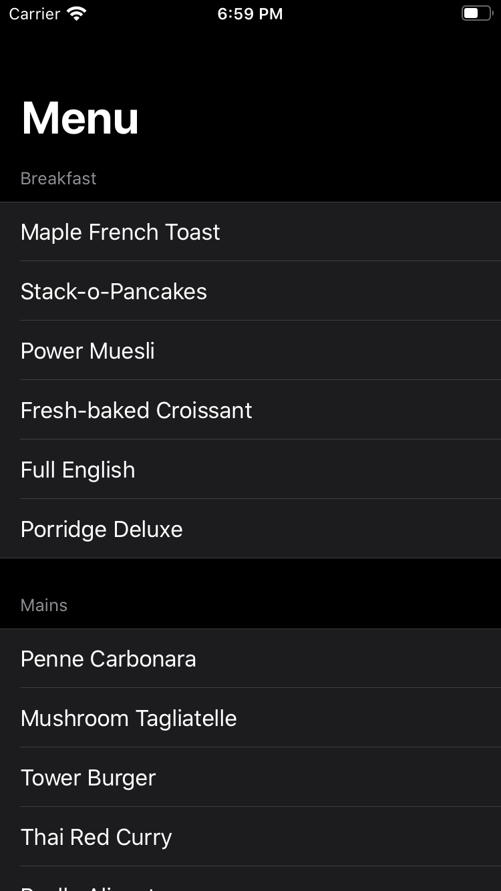
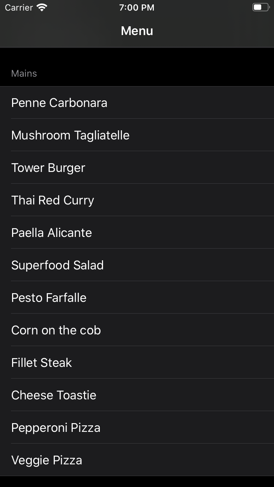

# Menu List
This is an example project of how to show menu list in a fascinating way.

## References
- https://www.hackingwithswift.com/quick-start/swiftui/swiftui-tutorial-building-a-complete-project
- https://www.hackingwithswift.com/quick-start/swiftui/building-a-menu-using-list